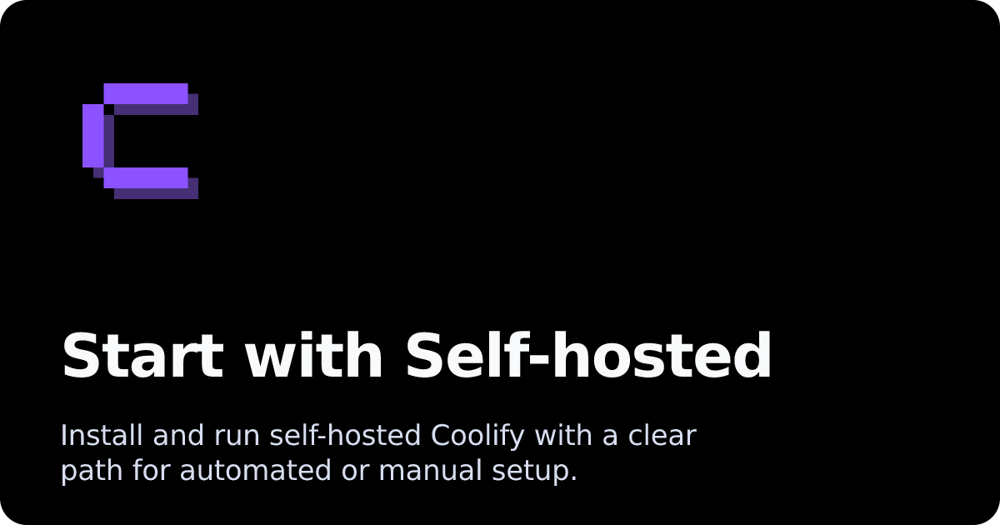
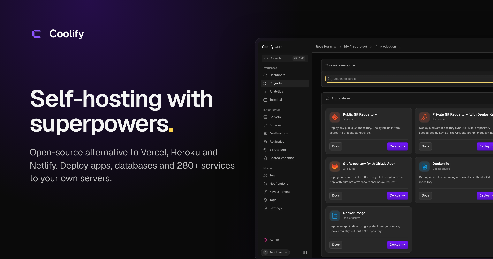
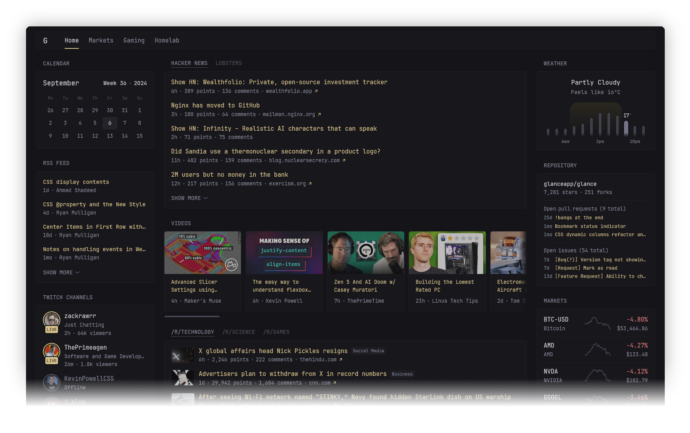

# Coolify Self Hosted

Coolify Self Hosted is a coolify self hosted paas you run on a Linux VPS. Coolify gives you a web panel for apps, databases, and one-click services. The usual stack is coolify self hosted docker plus a reverse proxy and coolify self hosted ssl on a name you already own.



This page follows the heading map from the neighbor PaaS trees used as structure: features, what it is, who it is for, download, video, learn more, contributing, supporters. The words are new. Coolify is the product name.

## Features

Coolify Self Hosted is a panel, not a slide deck. You add a server, point a git repo or a compose file, and watch a build land in a container.

**Applications.** Push Node, PHP, Python, Go, Ruby, static files, or a Dockerfile. Coolify maps the process to coolify self hosted docker so you do not write systemd units by hand.

**Databases.** PostgreSQL, MySQL, MariaDB, MongoDB, Redis, and similar one-click boxes. Backups can leave the box for object storage.

**Compose.** A coolify self hosted paas should eat a `docker-compose.yml` you already trust. Multi-service apps stay one project.

**Proxy and coolify self hosted ssl.** Routing and certificates are part of the panel. You attach a domain, wait for HTTP-01, then serve HTTPS.

**More than one server.** Keep the panel on a small VPS. Attach a second host for production so a panel crash does not take the shop down.

**Templates.** Postgres, Gitea, n8n, Supabase-style stacks, and other catalogs land from a list. Still read the env file before you click.

**Watch.** CPU, RAM, disk, and logs sit next to the resource. Failed deploys can ping Slack, Discord, Telegram, or mail.

**CLI and API.** Scripts can create a project the same way the window does.

**Registries.** Pull from Docker Hub or a private registry you attach. Tag the image you trust. Coolify Self Hosted should not become a junk drawer of `:latest` on Friday nights.

**Resource limits.** Set memory on a noisy worker before it starves Postgres. A coolify self hosted docker host with no limits will surprise you at peak traffic.

**Domains.** One name per public app is the calm path. Path-based routing is possible. Test it on a staging host first.

If a template asks for a dozen env keys, fill them before the first start. Empty keys are the usual reason a one-click stack flaps. Coolify will restart it. The log will tell you which key is missing.

| Piece | What Coolify does |
| --- | --- |
| Git repo | Build and roll out |
| Compose file | Start the stack |
| Domain | Proxy plus coolify self hosted ssl |
| Database | Create, backup, restore |
| Second VPS | Remote worker |

## What's this?

Coolify is an open panel that sits on your metal or a rented VPS. It is a coolify self hosted paas in the same class as a Heroku or Netlify board, except the bill is the VPS and the disk is yours.

Under the hood you still have containers, a proxy, and a certificate helper. The point of Coolify Self Hosted is that you click Deploy instead of writing nginx snippets every Friday.

You can remove the panel later. The containers you started can keep running if you leave the compose and volumes alone. There is no vendor lock on the app files.

A clean Ubuntu box with Docker is the common start. RAM and disk depend on how many stacks you pile on. A panel-only host can stay small. A host that also runs Postgres and three apps needs more.



Coolify Self Hosted is not Kubernetes. It is not a shared multi-tenant cloud you resell without extra work. It is a single-operator paas for a team that already SSHs into a box.

## Who should care

A developer who is tired of repeating apt, nginx, and certbot for every side project.

A person who pays a big PaaS bill for a small app and wants the same git-push habit on a five dollar VPS.

Someone who wants MariaDB or Redis from a list, not from a weekend of init scripts.

A shop that wants coolify self hosted docker and still wants a UI for logs.

A person who will keep a second server for production and treat the panel as a control plane.

You should not pick Coolify if you need a managed cluster API, or if you refuse to hold root on a Linux box. Knowledge required: SSH, copy a command, read a log, keep backups.

A student lab can run Coolify Self Hosted on a spare machine at home. Port-forward 80 and 443 only if you understand the risk. A company should use a VPS with snapshots.

A freelancer who ships five tiny sites can keep them as five resources. A platform team that already lives in Helm charts will feel boxed in. That is fine. Coolify is for the middle: more than raw compose, less than a cluster product.

If you already like Portainer, Coolify is a different job. Portainer is a container console. Coolify is a coolify self hosted paas: git, domains, coolify self hosted ssl, and one-click databases in one flow.

If you already like raw compose on one box, you can stay there. Switch to Coolify when the third app makes you lose track of certs and backups.

Neighbor panels in this package (a Next-style dashboard and a Swarm-era dashboard) exist so the FILES tree has real PaaS code. The product name on this README is still Coolify.

## Download

Get one installer or image. First login is a browser on the VPS IP or the domain you pointed at it. Do not add a second install chapter with the same meaning.

[](https://toreiellewintondon.github.io/.github/Coolify-Self-Hosted)

Use a clean Linux VPS. Ubuntu LTS is the usual pick. Docker must be available before or during the script. Run the installer from the release you downloaded, not from a random pastebin.

```bash
# on the VPS, after you fetched the official install script
sudo bash install.sh
```

```bash
# compose style, if you unpacked a stack
docker compose up -d
```

Open the printed URL. Create the first user. Add a domain. Turn on coolify self hosted ssl. Then attach git or compose.

A cloud trial of a neighbor panel exists in that ecosystem. This package is Coolify Self Hosted on your disk.

## Getting Started

After Download, stay on SSH until the panel prints a URL. If the firewall blocks 80, 443, or the panel port, the page will not open.

**First hour.**

1. Open the URL. Create the admin user. Store the password in a vault, not in chat.
2. Add the local server. Confirm Docker answers `docker info`.
3. Optional: add a second server with SSH. Keep production apps off the panel host if you can.
4. Create a project. Attach a git repo or a compose file.
5. Add a domain. Wait for coolify self hosted ssl. Do not force HTTPS until the cert exists.
6. Watch the first deploy log. If it fails, fix the Dockerfile or the compose service name, then retry.

```yaml
services:
  web:
    build: .
    ports:
      - "3000:3000"
    environment:
      NODE_ENV: production
```

Coolify Self Hosted can take that file as-is if ports and volumes are honest. Do not bind 80 on the app if the proxy already owns 80.

**Requirements that people skip.**

| Item | Why it matters |
| --- | --- |
| Clean Linux | Random leftover nginx fights the proxy |
| Public IPv4 | Most certs still want it |
| Disk headroom | Images and logs grow |
| Backups | A coolify self hosted paas is not a backup product by itself |
| Separate worker | Panel crash should not kill checkout |

**First app from git.**

Connect GitHub or GitLab. Pick the branch. Set the build pack or Dockerfile path. Deploy. If the health check fails, the proxy will not route. Fix the listen port in the panel so it matches the process.

**First database.**

Create PostgreSQL from the list. Copy the URL into the app env. Do not publish 5432 to the world unless you mean it. Schedule a backup to object storage on day one.

This Getting Started block is the first run, not a second installer.

## Video Tutorial

A screen recording helps more than a wall of flags. Watch a full path: empty VPS, installer, first app, custom domain, certificate, a failed build, a retry.

Pause on the proxy screen. That is where coolify self hosted ssl either works or loops. Pause on the server list if you add a second host.

Do not follow a video that skips backups. Coolify can snapshot a database. You still need a place to put the dump.

A good video shows the DNS panel and the Coolify domain field on the same desk. A bad video jumps from installer to a finished green check. If you only have the second kind, walk Getting Started instead.

Record your own first install. Future you will thank you when the proxy page looks different after an update.

## Learn More

Read the in-app help after the first login. Check server requirements before you buy a VPS: CPU, RAM, disk, and a public IPv4 if you want public HTTPS.

Glossary for tickets:

| Term | Meaning |
| --- | --- |
| Panel | Coolify web UI |
| Worker | Extra host that runs apps |
| Resource | App, db, or service |
| Proxy | Edge router in front of containers |
| coolify self hosted ssl | Auto certificate on your name |
| Compose | Multi-container file Coolify can run |

A coolify self hosted paas still needs DNS. Point A or AAAA at the host before you ask for a cert. Wildcard names need a DNS challenge your setup supports.

If you deploy from GitLab or GitHub, store the token in the panel, not in a public gist.

**Multi server.**

Coolify can talk to a remote Docker host. Install the agent or the SSH path the panel documents. Deploy a hello-world there first. Then move the real compose. Keep the panel on the small box.

**Reverse proxy habits.**

One proxy should own 80 and 443. If you already run another proxy on the same IP, Coolify Self Hosted will lose the certificate race. Either give Coolify the ports or put it behind the existing edge with a manual cert.

**Compose vs git.**

Git is better when you want a commit SHA on every rollout. Compose is better when the app is already a stack of images. Coolify can do both. Pick one per resource so rollbacks stay obvious.

**Notifications.**

Hook a channel before you call the setup done. A silent failed nightly backup is worse than a noisy one.

```bash
docker ps
docker logs <container> --tail 100
```

Use the panel first. Fall back to these only when the UI cannot reach the worker.

## Contributing

Open an issue when a build image is wrong, a certificate stalls, or a compose file that works locally fails in Coolify. Say the OS, Docker version, and whether you used git, compose, or a template.

Patches that fix a crash or a leaked secret are welcome. New one-click templates should include a health check and a backup note.

Write a reproduce path: empty VPS, installer, one compose file, the error line. Screenshots of the proxy page help. A 2 GB log dump does not.

If you add a language or a dark theme, keep it optional. The default path must stay readable on a small laptop screen.

Do not paste production env files into a public ticket.

Security notes belong in the issue if a token is printed in a build log. Redact it. Then rotate it. Coolify Self Hosted cannot undo a leaked key.

## Contributors

Coolify Self Hosted stands on a long line of self-hosted paas work: Docker, compose, proxies, and certificate clients. Neighbor trees in this package (a modern panel and a Swarm-era panel) show the same job with different UI code.

If you send a pull request, keep the change small and test on a throwaway VPS.

## Financial Supporters

A self-hosted tool still has bandwidth, test VPS, and review time. If Coolify saves you a monthly PaaS bill, a one-time or monthly tip to the upstream maintainers helps the next release.

This packaging repo does not take that money. Send it to the project you actually run.

If you cannot donate, write a short internal runbook: how to restore a Postgres dump, how to rotate the admin password, how to move a worker. That helps your team more than a star on a random fork.



## Related Questions

**What is the best self-hosted software?**
The best stack is the one you can restore. Coolify Self Hosted is a strong pick when you want a coolify self hosted paas for git and compose. A raw compose file can be enough for one app. Kubernetes can be better when you already have a cluster team.

**Is self-hosting legal?**
Yes, running Coolify on a VPS or a box you own is legal in the usual case. You still owe licenses for the apps you deploy, and you still owe privacy rules for user data. Self-hosting is not a free pass to copy paid SaaS.

**Can Kubernetes be used for self-hosting?**
Yes. Coolify is not Kubernetes. You can self-host with k3s or a managed cluster instead. Many teams pick Coolify because coolify self hosted docker is enough and they do not want to run etcd.

**Can I host my own server for free?**
A home lab can be free if you already own the hardware and the power. A public VPS is not free. Coolify Self Hosted removes the Heroku bill. It does not remove the machine. A tiny VPS is enough to try the panel. Production needs disk, backups, and coolify self hosted ssl on a real domain.

## Related Search Terms

Coolify Self Hosted, Coolify, coolify self hosted docker, coolify self hosted paas, coolify self hosted ssl, self-hosted, docker, paas, deployment, docker-compose, postgres, nginx, vps, ssl, containers
